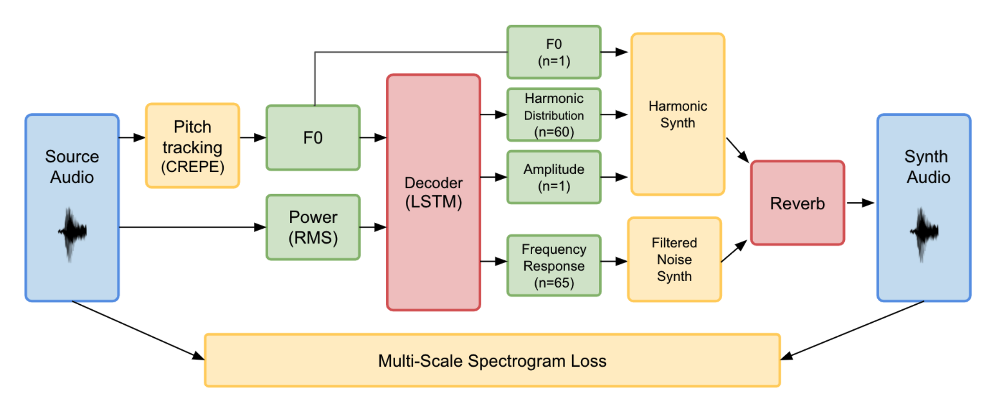

# tone-transfer

Ein Projekt von Moritz Blum (JLU) und Jannis Müller (THM).
Basierend auf den Arbeiten:
- [DDSP: Differentiable Digital Signal Processing](https://doi.org/10.48550/arXiv.2001.04643)
- [Tone Transfer](https://ceur-ws.org/Vol-2903/IUI21WS-HAIGEN-3.pdf)
- [SPICE](https://doi.org/10.1109/TASLP.2020.2982285)
- [WaveNet](https://doi.org/10.48550/arXiv.1609.03499)

Mit "tone-transfer" lässt sich der Klancharakter eines Instruments auf jede belibige monophone Audioquelle übertragen. Anbei sind beispielsweise zwei eigene Trompetenaufnahmen zum Testen. Das Ziel ist es, die aufgenommene Sequenz so klingen zu lassen, als würde sie von dem trainierten Instrument (in unserem Fall eine E-Gitarre) gespielt werden.

## E-Gitarre
Die Netze können mit jedem monophonen Instrument trainiert werden. Wir haben uns für eine E-Gitarre der Marke "Duesenberg" entschieden, die gerade für >2.500€ erhältlich sind. In der Praxis könnte das Netz bei der Musikproduktion für's Prototyping genutzt werden, um zu Testen, ob die E-Gitarre in einen Song passen würde. Im Live-Einsatz könnte mit einer Implementierung als Audio-Plugin z.B. [hier](https://magenta.tensorflow.org/ddsp-vst) benutzt werden, falls das Instrument benötigt wird, aber nicht vorhanden ist.

# Inhalt
- [`tone_transfer_train.ipynb`](https://colab.research.google.com/drive/1xPFgQtdMJi3TNMQtiCM5-PJ7Efi4cXu9?usp=sharing): Trainingsnotebook mit Datenvorbereitung
- [`tone_transfer_inference.ipynb`](https://colab.research.google.com/drive/1XUDI8shyGKISdyhbyytjak474XAgTVkF?usp=sharing): Testnotebook mit Möglichkeit zum Upload von eigenen Audiodateien
- [`model.zip`](https://drive.google.com/file/d/1Gyyhs7WLa21DMMv_ZQR6mbJIeJDzLdvq/view?usp=sharing): Das Modell. Kann bei der Inferenz hochgeladen werden.
- `tequila.wav` & `mas_que_nada.wav`: Trompetenaufnahmen für das Testen

## Datensatz
Der Datensatz befindet sich in [diesem Google-Drive Ordner](https://drive.google.com/drive/folders/1Y2HU3L9bbDXopPPFhmfxj9h36lKI5bkP?usp=sharing). Eine zwanzigminütige Aufnahme der E-Gitarre wurde in drei Ordner aufgeteilt: `train` (~70%), `val`(~20%) und `test`(~10%). 

Die Audiodateien wurden für die drei Phasen in jeweils 4 Sekunden lange Abschnitte unterteilt. Mithilfe des bestehenden Netzes "SPICE" wurde die Tonhöhe analysiert und zusammen mit der Lautstärke als [TFRecord](https://github.com/google/tensorflow-recorder) abgespeichert. Da dieser Prozess mehr Rechenaufwand als das Training selbst benötigt, wurde dies im Vorfeld berechnet und abgespeichert. 

## Ausführung
Die Jupyter-Notebooks sind für die Ausführung in Google Colab konzipiert. Eine genaue Anleitung zur Ausführung befindet sich in den jeweiligen Notebooks. Die Links der Notebooks führen direkt zu Google Colab. 

# Erläuterung der Grundidee
Auszug aus der Dokumentation:

Viele frühere Ansätze versuchen, Audio in Frequenz oder Zeitbereich zu generieren. Damit ist die Menge der erzeugbaren Klänge enorm, wobei in der Regel nur ein ganz bestimmter Klang erwartet wird. Dazu kommt, dass das Netz die komplexe Kodierung von Audiosignalen lernen muss. Beispiele dafür sind die Zusammenhänge zwischen Samples und Frequenz im Zeitbereich und von Grundfrequenz zu Oberschwingungen im Frequenzbereich. Dadurch geht ein großteil der Trainingskapazitäten des Netzes für das lernen der Kodierungen verloren. Für komplexe Signale, wie Sprache, ist dies zwar notwendig, aber bei Instrumenten handelt es sich meist um deutlich einfachere Klänge, nämlich um angeregte harmonische Schwingungen. Dieses Domänenwissen nutzt das Paper “Differential Signal Processing” (DDSP) aus. Es stellt eine Architektur vor, indem das Netz das Audiosignal nicht direkt erzeugt, sondern nur die Parameter von zwei verschiedenen Synthesizern steuert. Der erste Synthesizer, ein Additiver Synthesizer, dient der Erzeugung von Grund- und Obertönen der melodischen Klanganteile. Der zweite Synthesizer, ein Noise-Synthesizer, ist für die nicht-melodischen Klanganteile zuständig, wie das Anschlagen einer Saite oder das Blasen in eine Trompete.

blau: Trainingsdaten, gelb: nicht trainierbare DDSP-Module, grün: attribute, rot: trainierbare Module (statt LSTM haben bei uns GRUs besser funktioniert. Mehr dazu in der Präsentation und im Paper).

Am Ende der Verarbeitungskette befindet sich ein trainierbares Hall-Modul. Damit wird die Aufnahmemgebung in dem das Instrument modelliert, was allein mit den Synthesizern nicht möglich wäre. Jeder natürliche Hall lässt sich mit einer Impulsantwort mit einer Länge von mehreren Sekunden beschreiben. Das summierte Audiosignal der beiden Synthesizer wird mit der Impulsantwort des Halls gefaltet um das finale Ausgangssignal des Systems zu erhalten. Somit ist die Funktionsweise ähnlich zu einem CNN mit nur einem einzigen enormen Filter. Die Impulsantwort wird entweder separat aufgenommen, oder kann gleichzeitig mit dem Rest des Netzes trainiert werden. Im Live-Einsatz kann das Reverb-Modul gegen ressourceneffizientere oder künstlerisch ansprechendere Alternative ersetzt werden. In unserem Fall wurde die E-Gitarre nicht mit einem Mikrofon aufgenommen, sondern wurde direkt an das Aufnahmegerät angeschlossen. Somit ist auf der Aufnahme kein Raumhall enthalten. Deswegen sorgte der Hall im Training für insgesamt schlechtere Ergebnisse und wurde bei unserem Abgabenetz nicht verwendet.  

# Optimizer und Hyperparameter:
Neben der grundlegenden Architektur (Vorverarbeitung, Synthesizer, ...) haben wir uns mit der Lernrate von `0.001` und dem Optimizer `ADAM` am DDSP-Paper orientiert. Zudem haben wir bei dem Training von RNNs `Gradient Clipping`(Wert: `3.0`) verwendet. So konnte eine Überfixierung auf die stillen Teile  der Trainingsdaten in den ersten Trainingsschritten vermindert werden. Da die Daten einen hohen zeitlichen Zusammenhang besitzen wurden die Parameter für jeden 4-Sekündigen Abschnitt (Länge ebenfalls vom DDSP-Paper empfohlen) optimiert. 

Für den Decoder wurde eine auf "Gated Recurrent Units"-basierende Architektur gewählt. Im Vergleich mit LSTMs erzielten GRUs mit weniger Parametern schneller bessere Ergebnisse (Genaue Zahlen dazu in der Dokumentation). Ansätze basierend aus Dilated Convolutions, wie im Tone-Tranfer-Paper beschrieben, erzielten dabei schlechtere Metriken, als das RNN-basierte Netz

# Metriken
Als Metriken haben wir uns neben der Hörprobe für folgende Metriken entschieden:

- Spektrogramm-Abgleich: Die Differenz der Spektrogramme für jeden Frequenz und jeden Zeitschritt. Auch als Loss-Funktion verwendet. Korreliert gut mit der groben Ähnlichkeit von zwei Klängen. Bei feinen Wetunterschieden <<0.5 zwischen zwei unterschiedlichen Vorhersagen wird die genaue Zahl jedoch weniger aussagekräftig.
- Gewichtete Lautstärke: An das menschliche Ohr angepasste Lautstärkeschätzung. Differenz zwischen Eingabelautstärke und Ausgabelautstärke. Durch die Gewichtung der Frequenzen ist sie oft mehr aussagekräftig beim Vergleich von zwei Vorhersagen mit sehr ähnlichem Spektrogramm-Loss. Liefert dann eine bessere Aussage über die Gesamtähnlichkeit (nicht nur die Ähnlichkeit zweier Frequenzen)
- Wasserstein-Distanz: Genauere Metrik umd die Ähnlichkeit zweier Signale zu erfassen.

